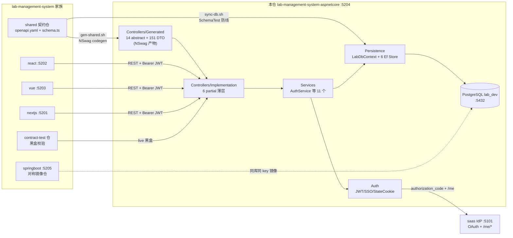
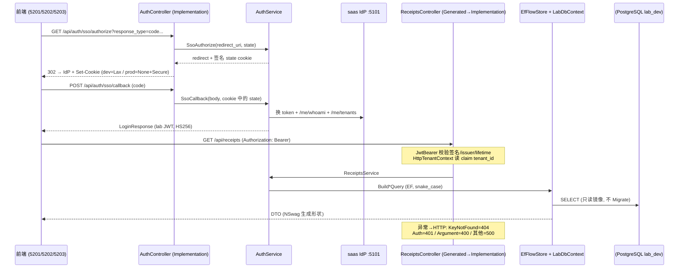

# lab-management-system-aspnetcore 架构

> 一句话定位：lab-management-system 多仓家族中的 ASP.NET Core 8 后端仓——消费 shared 契约仓的 OpenAPI/DB schema 生成物，与 springboot 仓互为跨栈镜像实现，供 react/vue/nextjs 三前端与 contract-test 仓黑盒消费，前端不可区分。

生成日期：2026-09-22 ｜ 锚定 HEAD：07cfb4b ｜ 生成方式：DeepWiki 风格架构扫描

## 1. 总览

- **家族角色**：后端仓（6 角色中的「后端」）。同一份产品契约（`../lab-management-system-shared`）由多前端 + 多后端各自实现；本仓与 `lab-management-system-springboot` 对称，共享同一 `lab_dev` PostgreSQL 库与同一 `JWT_SIGNING_KEY`（token 互认）。
- **技术栈**：.NET 8（`net8.0`）+ ASP.NET Core MVC + EF Core 8 / Npgsql 8.0.8 + JwtBearer 8.0.8 + Swashbuckle 6.6.2 + xUnit。版本钉死于 `version-lock.json`。
- **双身份**：书稿配套仓（代码块 source of truth）+ harness 门禁仓。
- **规模速览**（真实统计）：src + tests 共 232 个 `.cs` 文件（src 约 16.4k 行 / tests 约 4.9k 行）；14 个 NSwag 生成的 abstract Controller + 151 个生成 DTO；119 条路由；21 个测试文件、202 个 `[Fact]`/`[Theory]`。
- **关键架构决策**：DB-First（ADR-0025/0033，schema 真源在 shared `src/db/schema.ts`，本仓 EF 只读不 Migrate）；恒 real SSO（2026-09-20 人裁删 no-sso profile）；恒 EF（删 memory provider）；ADR-0019 env 全 fail-fast 禁字面兜底。

## 2. 系统架构

关键边界解读：本仓对 shared 契约有**两条独立消费通道**——API 面（`gen-shared.sh` 产 Generated 代码）与 DB 面（`sync-db.sh` 只校验不建表）。Generated ↔ Implementation 是双侧契约：Generated 是 NSwag 重生成即覆盖的 abstract 基类，Implementation 是手写 partial，**只许改 Implementation 修漂移**。运行时只对外依赖一个真后端依赖（saas IdP）与一个 PG 库，与 springboot 仓共库共签名密钥。

## 3. 模块分解

| 模块/目录 | 职责 | 关键文件 |
|---|---|---|
| `src/Controllers/Generated/` | NSwag 按 tag 拆分的 14 个 abstract Controller 基类 + 路由/校验特性，重生成即覆盖 | `ReceiptsController.cs`（14 路由）等 |
| `src/Controllers/Implementation/` | 手写 partial 薄层：取 claims、转发 Service、写 Set-Cookie；禁写业务逻辑 | `AuthController.cs`、`CatalogController.cs`、`ContractController.cs`、`DictionaryController.cs`、`MethodAndRequirementController.cs`、`SummaryController.cs` |
| `src/Models/Generated/` | 151 个 DTO + enum（Record 风格，含 Wire 枚举转换器适配） | `SampleReceipt.cs`、`AuthState*.cs` 等 |
| `src/Services/` | 业务逻辑层（11 个 Service），异常语义：`KeyNotFoundException`→404、`MenusUnavailableException`→503 | `AuthService.cs`（登录/SSO/切租户/菜单）、`ReportFlowService.cs`、`SampleReceiptService.cs` |
| `src/Auth/Jwt/` | HS256 签发与校验。`LabTokenValidationFactory` 恒真签名验证（`RequireSignedTokens=true`，替代早期 SignatureValidator 绕过） | `LabJwtSigner.cs`、`LabTokenValidationFactory.cs`、`LabOptions.cs` |
| `src/Auth/Sso/` | saas IdP 客户端（authorization_code + /me/whoami、/me/tenants）+ 错误映射 Handler + 菜单/成员快照缓存 | `ISaasAuthClient.cs`、`ISaasMeClient.cs`、`SaasErrorMappingHandler.cs`、`MenuSnapshotCache.cs` |
| `src/Auth/State/` | SSO CSRF state cookie（HS256 签名，密钥复用 `JWT_SIGNING_KEY`；dev 明文 http 走 Lax，prod 走 None+Secure） | `StateCookieManager.cs` |
| `src/Persistence/` | EF Core 只读镜像层：`LabDbContext` 手写映射（DTO==entity 零转换），6 个 Ef Store 实现 Store 接口；`UseSnakeCaseNamingConvention()` 防 PascalCase↔snake_case 漂移 | `LabDbContext.cs`、`EfCatalogStore.cs`、`EfFlowStore.cs` |
| `src/Security/` | 租户上下文：从 JWT claim `tenant_id` 读 | `TenantContext.cs` |
| `src/Hosting/` | 家族统一 `SERVER_PORT` 监听 shim（裸机 `dotnet run` 用） | `ServerPortShim.cs` |
| `src/Serialization/` | enum member 序列化转换器（Wire 枚举对齐契约） | `EnumMemberEnumConverter.cs` |
| `src/Data/` + `src/Directory/` | Store 接口定义；配置式 demo 用户目录（dev 口令必填，无字面兜底） | `IStores.cs`、`ConfigUserDirectory.cs` |
| `scripts/` | codegen / schema 同步 / trace / live 冒烟 | `gen-shared.sh`、`sync-db.sh`、`patch-generated.py`、`split-nswag-output.py`、`gen-trace.py`、`live_smoke.py` |
| `tests/` | xUnit：Services 单测（InMemory TestDoubles）+ Harness（EF 可翻译性、PG 真库 `*PgTest`、SchemaTest）+ Auth/Sso | `tests/Harness/LabDbContextSchemaTest.cs`、`tests/TestDoubles/` |

## 4. 数据流 / 请求生命周期

代表性链路：**SSO 登录 → 带 Bearer 的 CRUD（receipts）**。

非 SSO 的直登路径走 `POST /api/auth/login`（permitAll 三端点：login / refresh / sso/**，镜像 springboot SecurityConfig 列表），`ConfigUserDirectory` 校验 demo 目录口令后由 `LabJwtSigner` 签发同族 HS256 token。

## 5. 依赖面

**对 shared 契约仓（`../lab-management-system-shared`）**：
- API 面：`scripts/gen-shared.sh` → shared `npm run emit:openapi` 产 `generated/openapi/openapi.yaml` → NSwag（`aspnetcore.nswag`）单文件 `AllGenerated.cs` → `patch-generated.py` 修补 NSwag 缺陷 → `split-nswag-output.py` 按 tag/class 拆 14 controllers + 151 models → `dotnet build` 自检 Implementation 漂移（fail-fast）→ 写 `.state/last-gen-shared.json` 的 `api_synced_*` marker（ADR-0026，同 sha 零写入）。
- DB 面：`scripts/sync-db.sh` → 跑 `LabDbContextSchemaTest`（EF 全模型 ↔ 共享 PG 物化态逐列对照）→ 绿则写 `db_synced_*` marker。**禁 EF Migrations**，漂移 = 修 `LabDbContext` 映射。

**对家族其他仓**：与 react/vue/nextjs 三前端（CORS 白名单 `LAB_CORS_ALLOWED_ORIGINS`，`AllowCredentials` 供 state cookie 跨源）；与 springboot 共 `lab_dev` 库、共 `JWT_SIGNING_KEY`（token 互认）、同 IdP；contract-test 仓 live 模式黑盒打到本仓 :5204。

**外部依赖**：PostgreSQL `lab_dev`（Npgsql 格式 `DATABASE_URL`）；saas IdP :5101（`LAB_SAAS_BASE_URL`，服务账号 `LAB_SAAS_SERVICE_USER` 拉菜单快照）。

## 6. 配置与部署

env 变量表（`.env.example`，全部 fail-fast，缺失即 throw——ADR-0019 禁字面兜底）：

| key | 用途 | 缺失时行为 |
|---|---|---|
| `SERVER_PORT` | 家族统一监听端口（本仓 5204，`ServerPortShim` 接线） | `ASPNETCORE_URLS` 优先；容器内由 Dockerfile ENV 固定 |
| `DATABASE_URL` | Npgsql 连接串（lab_dev） | `InvalidOperationException` throw |
| `JWT_SIGNING_KEY` | HS256 签名密钥（≥32B，与 saas/lab-springboot 共享） | `ConfigBuilder.RequireJwtSigningKey` throw |
| `JWT_ISSUER` / `JWT_AUDIENCE` | token 签发方/受众 | throw |
| `JWT_TTL_SECONDS` / `JWT_REFRESH_TTL_SECONDS` | access/refresh 有效期 | throw（无默认值） |
| `LAB_CORS_ALLOWED_ORIGINS` | 三前端 + IdP origin 白名单 | `RequireCorsOrigins` throw |
| `LAB_SAAS_BASE_URL` / `LAB_SSO_LOGIN_URL` | saas IdP 地址 | LabOptions 必填 |
| `LAB_SAAS_CLIENT_ID` / `LAB_SAAS_CLIENT_SECRET` | OAuth code 流客户端 | 必填 |
| `LAB_SAAS_SERVICE_USER` / `LAB_SAAS_SERVICE_PASSWORD` / `LAB_SAAS_SERVICE_CLIENT_ID` | 菜单快照服务账号 | 必填 |
| `Lab__Auth__DevPassword` | demo 用户目录口令（dev 也必须显式声明） | `RequireDevPassword` throw |

端口与部署：dev/容器统一监听 **:5204**；VPS nginx 反代 host **8014**（`lab-aspnetcore.xiangru.uk`，家族 801x 分段）。构建产物 = multi-stage `Dockerfile`（sdk:8.0 publish → aspnet:8.0 debian-slim，非 root `labasp`，HEALTHCHECK wget 探 `/health`）。CI（`.github/workflows/ci.yml`）：branch push 只跑 test；tag `v<X>.<Y>.<Z>-<YYYYMMDD>` 触发 test + docker build/push + VPS 部署（`deploy/lab-management-system-aspnetcore.sh`，deploy 脚本自举随机 `JWT_SIGNING_KEY` 入 env-file）。

## 7. 质量门禁

来自 `.harness/stack.json`（suite `python scripts/gate.py -p lab-management-system-aspnetcore` 驱动）：

| 门 | 名称 | 命令 |
|---|---|---|
| L1 | 格式 | `dotnet format src/Lab.AspNetCore.csproj --verify-no-changes` |
| L2 | 静态检查 | `dotnet build src/Lab.AspNetCore.csproj /p:TreatWarningsAsErrors=true` |
| L3 | 编译 | `dotnet build tests/Lab.AspNetCore.Tests.csproj` |
| L4 | 测试 | `dotnet test tests/Lab.AspNetCore.Tests.csproj --no-build` |

trace 由 `python scripts/gen-trace.py` 产出（TRX 适配器），功能 ID 挂在 Implementation/Service 层测试上。exit code 语义：**0 = 完成；1 = 按修复提示回代码；2 = 契约/环境问题，停下问人**。本仓硬约束：TDD 红绿循环、禁手改 NSwag 产物、禁 Controller/Program.cs 写业务、禁 catch 吞异常。
