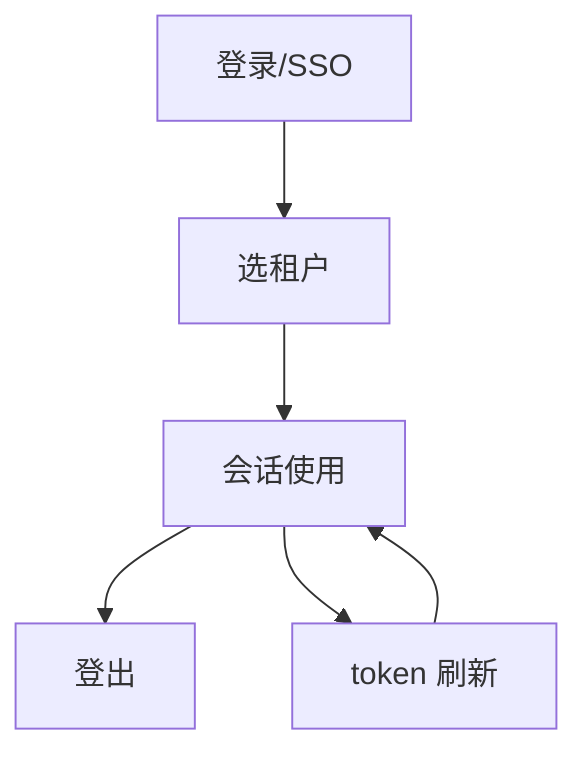
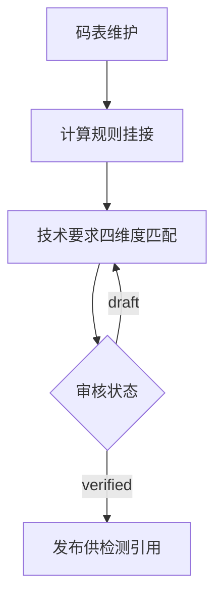
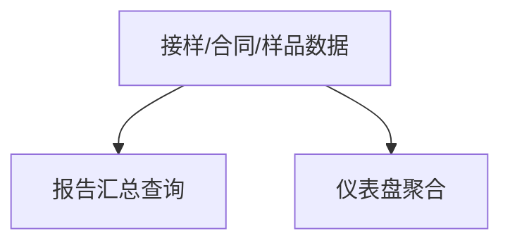
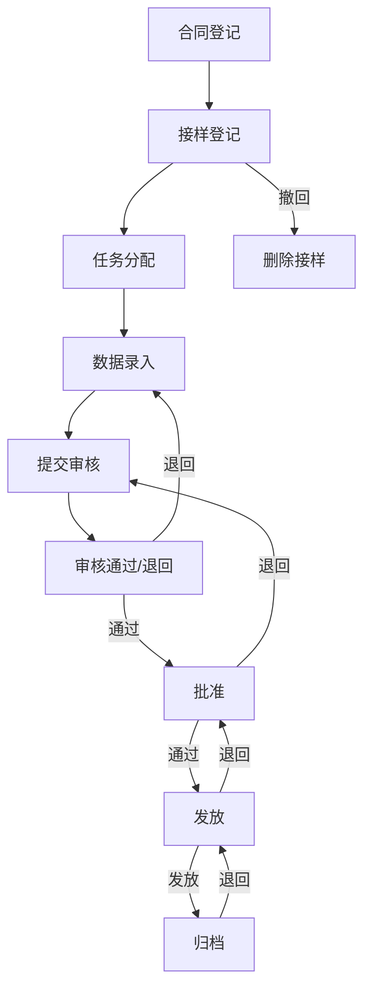

# 流程与功能对齐 — 实验室管理系统ASP.NET-Core后端

> 人填、人评审。机器只检查引用的功能 ID 是否存在。
> 评审时把流程图投出来，逐行念「这一步靠哪些功能完成」。念不出来的行，
> 要么流程是空的，要么功能是缺的。这就是对齐的全部意义。

## FLOW-01 认证与会话（B1）

| 步骤 | 名称 | 角色 | 输入 | 输出 | 状态流转 | 支撑功能子项 |
|---|---|---|---|---|---|---|
| S01 | 登录（密码或 SSO 跳 saas） | 所有用户 | username/password 或 sso code | access/refresh token + 租户列表 | anonymous -> awaiting_tenant | M01.F05.I01, M01.F05.I02, M01.F05.I03 |
| S02 | 选租户换发 token | 所有用户 | tenantId | 携带 tenant_id claim 的新 token | awaiting_tenant -> authenticated | M00.F02.I01 |
| S03 | 会话使用（me/菜单/权限） | 所有用户 | Bearer token | user + tenants + currentTenantId / 菜单树 / 权限集 | authenticated | M00.F01.I01, M01.F04.I01, M01.F04.I02 |
| S04 | 登出 | 所有用户 | Bearer token | 204 | authenticated -> anonymous | M01.F05.I05 |
| S05 | token 刷新 | 所有用户 | refreshToken | 新 access token | authenticated（续期） | M01.F05.I04 |

## FLOW-02 检测基础数据维护（B2）

| 步骤 | 名称 | 角色 | 输入 | 输出 | 状态流转 | 支撑功能子项 |
|---|---|---|---|---|---|---|
| S01 | 码表维护（型号/规格/等级/牌号 CRUD） | 管理员 | code/name/objectCode | 码表行 | - | M04.F06.I01, M04.F06.I02, M04.F06.I03, M04.F06.I04, M04.F07.I01, M04.F07.I02, M04.F07.I03, M04.F07.I04, M04.F08.I01, M04.F08.I02, M04.F08.I03, M04.F08.I04, M04.F09.I01, M04.F09.I02, M04.F09.I03, M04.F09.I04 |
| S02 | 计算规则挂接（object+parameter 复合键） | 管理员 | 算法类型/公式/试件数 | 计算规则行 | - | M06.F05.I01, M06.F05.I02, M06.F05.I03, M06.F05.I04, M06.F05.I05 |
| S03 | 技术要求维护（三键 + 四维度匹配） | 管理员 | 判定标准/限值/brand/model/grade/spec | 技术要求行 | draft | M06.F06.I01, M06.F06.I02, M06.F06.I03, M06.F06.I04, M06.F06.I05 |
| S04 | 审核状态推进 | 审核人 | verificationStatus | reviewed/verified/rejected | draft -> verified | M06.F06.I04 |
| S05 | 发布供检测引用 | - | - | - | verified | -（下游 M03 消费） |

## FLOW-03 统计分析（B4）

| 步骤 | 名称 | 角色 | 输入 | 输出 | 状态流转 | 支撑功能子项 |
|---|---|---|---|---|---|---|
| S01 | 数据积累（接样推进 + 合同/样品登记） | 所有角色 | - | - | - | -（B2/B3 上游） |
| S02 | 报告汇总查询 | 管理层 | categoryCode/dateFrom/dateTo | SummaryData 6 列行集 | - | M05.F01.I01 |
| S03 | 仪表盘聚合 | 所有用户 | - | 计数 + 3 桶 + pendingTask | - | M05.F02.I01 |

## FLOW-04 试验流程主流程（B3）

| 步骤 | 名称 | 角色 | 输入 | 输出 | 状态流转 | 支撑功能子项 |
|---|---|---|---|---|---|---|
| S00 | 合同登记 | 收样员 | 合同信息 | Contract | - | M02.F01.I01, M02.F01.I02, M02.F01.I03, M02.F01.I04, M02.F01.I05 |
| S01 | 接样登记 | 收样员 | 委托/样品信息 | SampleReceipt（receiving 起步） | -> receiving | M03.F01.I01, M03.F01.I02, M03.F01.I03, M03.F01.I04, M03.F01.I05, M03.F09.I01 |
| S02 | 任务分配 | 组长 | assignee/plannedDate | 接样单挂任务字段 | receiving -> task_assignment | M03.F02.I01 |
| S03 | 数据录入（样品+检测记录） | 检测员 | 样品/检测结果/改判 | Sample + TestRecord | task_assignment -> data_entry | M03.F03.I01, M03.F03.I02, M03.F03.I03, M03.F03.I04, M03.F03.I05, M03.F03.I06, M03.F03.I07, M03.F03.I08, M03.F03.I09, M03.F03.I10, M03.F03.I11 |
| S04 | 流程历史可追溯 | 所有角色 | - | FlowHistoryEntry[] | 全程记录 | M03.F01.I06 |
| S05 | 审核 | 审核员 | stage=review 队列 | 通过→approval / 退回→data_entry | review <-> | M03.F05.I01, M03.F05.I02, M03.F05.I03 |
| S06 | 批准 | 批准人 | stage=approval 队列 | 通过→issuance / 退回→review | approval <-> | M03.F06.I01, M03.F06.I02, M03.F06.I03 |
| S07 | 发放 | 发放员 | stage=issuance 队列 | 发放→archived / 退回→approval | issuance <-> | M03.F07.I01, M03.F07.I02, M03.F07.I03 |
| S08 | 归档（终态） | - | stage=archived 队列 | SUBMIT 无效 / 退回→issuance | archived（终态） | M03.F08.I01, M03.F08.I02, M03.F08.I03 |
| S09 | 撤回/删除 | 收样员 | WITHDRAW（仅 receiving 自转移）/ 删除接样 CASCADE | - | receiving 自转移 | M03.F08.I03, M03.F01.I05 |

### 评审时问这四个问题

1. 有没有哪个步骤的「支撑功能子项」是空的？→ 功能缺失，或这一步不该存在
2. 有没有功能子项从头到尾没出现在任何流程里？→ 见下方孤儿清单
3. 状态流转列里的状态名，和代码里的枚举一致吗？→ 不一致就是两套真相
4. 退回路径都画了吗？→ 只画正向流程，会漏掉一半功能

### 孤儿功能

不在任何流程里但合法的功能。**没解释的孤儿 = 没人要的功能。**

| 功能 ID | 为什么合法 |
|---|---|

---

## FLOW-02 （异常流程名）

> 异常流程单独成表，否则它承载的功能永远是孤儿。
